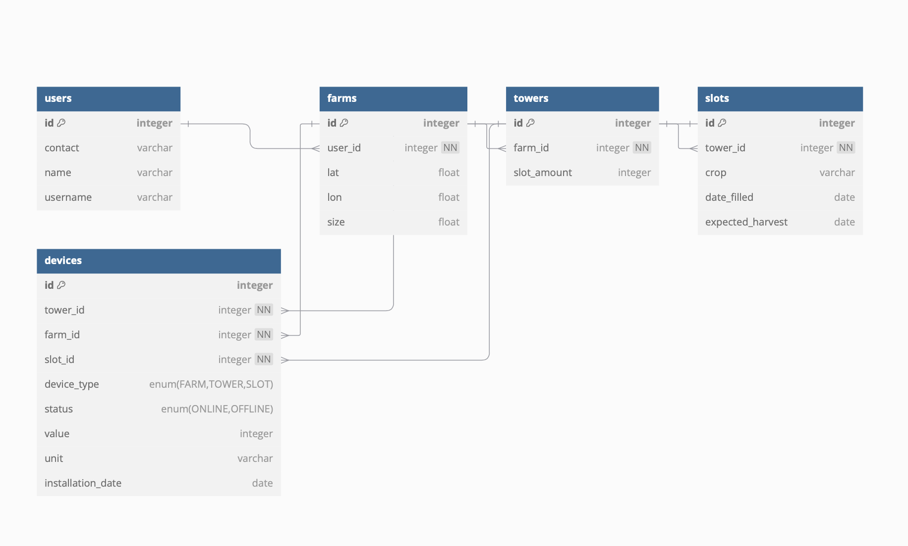

# Database Documentation

## Database Schema Diagram

```plaintext

```


Use tools like [dbdiagram.io](https://dbdiagram.io) to visualize this schema.

---

## Explanation of Tables and Relationships

### **User Table**
- **Purpose**: Stores user information.
- **Relationships**: Each user can own multiple farms.
- **Fields**:
    - `id`: Primary key.
    - `contact`: Contact information.
    - `name`: User's name.
    - `username`: Unique identifier for login.

### **Farm Table**
- **Purpose**: Represents a farm owned by a user.
- **Relationships**: Belongs to a user, contains multiple towers.
- **Fields**:
    - `user_id`: Foreign key to `User`.
    - `lat`, `lon`: Latitude and longitude for farm location.
    - `size`: Farm size in hectares.

### **Tower Table**
- **Purpose**: Represents a tower on a farm.
- **Relationships**: Belongs to a farm, contains multiple slots.
- **Fields**:
    - `farm_id`: Foreign key to `Farm`.
    - `slot_amount`: Number of slots available in the tower.

### **Slot Table**
- **Purpose**: Represents slots for planting crops.
- **Relationships**: Belongs to a tower, can be associated with a device.
- **Fields**:
    - `tower_id`: Foreign key to `Tower`.
    - `crop`: Type of crop planted.
    - `date_filled`: Date the slot was filled.
    - `expected_harvest`: Expected harvest date.

### **Device Table**
- **Purpose**: Tracks devices installed on farms, towers, or slots.
- **Relationships**: Belongs to a tower, farm, or slot.
- **Fields**:
    - `tower_id`, `farm_id`, `slot_id`: Foreign keys to their respective tables.
    - `device_type`: Enum indicating the type of device.
    - `status`: Enum indicating whether the device is ONLINE or OFFLINE.
    - `value`: Device-specific measurement value.
    - `unit`: Unit of the measurement (e.g., Celsius, liters).
    - `installation_date`: Date of installation.

---

## Data Flow Explanation

1. **Data Entry**:
    - User signs up → A `User` record is created.
    - User adds a farm → A `Farm` record is created with `user_id`.
    - User adds towers to the farm → `Tower` records are created with `farm_id`.
    - User adds slots and devices → `Slot` and `Device` records are created with references to related towers and farms.

2. **Data Retrieval**:
    - Fetch all farms for a user: Query `Farm` using `user_id`.
    - Fetch devices for a farm: Query `Device` using `farm_id`.
    - Fetch slot information for a tower: Query `Slot` using `tower_id`.

3. **Integration with External Tools**:
    - **Redis**: Cache frequently queried data like farms and towers.
    - **Dockerized Services**: Use environment variables to configure database access securely.

---

## Example SQL Queries

### Fetch all farms for a user
```sql
SELECT *
FROM Farm
WHERE user_id = 1;
```

### Fetch towers and their slots for a farm
```sql
SELECT T.id AS tower_id, S.id AS slot_id, S.crop
FROM Tower T
LEFT JOIN Slot S ON T.id = S.tower_id
WHERE T.farm_id = 1;
```

### Fetch all online devices in a farm
```sql
SELECT *
FROM Device
WHERE farm_id = 1 AND status = 'ONLINE';
```

### Insert a new device
```sql
INSERT INTO Device (tower_id, farm_id, slot_id, device_type, status, value, unit, installation_date)
VALUES (1, 1, 1, 'TOWER', 'ONLINE', 100, 'Celsius', '2024-01-01');
```

---

## Interactions Between Dockerized Services and the Database

### Dockerized MySQL Database
- Use a Dockerized MySQL instance with the `MYSQL_ROOT_PASSWORD` set.

### Example `docker-compose.yml` Snippet
```yaml
services:
  db:
    image: mysql:latest
    environment:
      MYSQL_ROOT_PASSWORD: secret
    ports:
      - "3306:3306"
    networks:
      - app-network

  app:
    build: .
    environment:
      DATABASE_URL: mysql://root:secret@db:3306/mydatabase
    networks:
      - app-network

networks:
  app-network:
```

### Redis for Caching
- Add caching for frequently accessed queries to improve performance.

---


